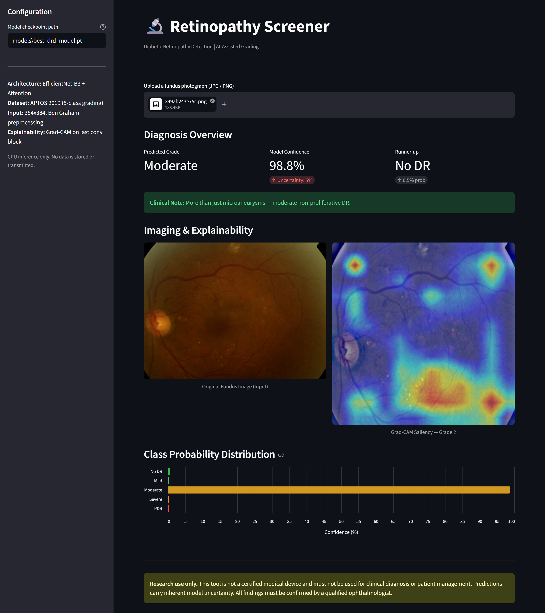

# Hybrid Diabetic Retinopathy Detection

A deep learning web application for automated grading of diabetic retinopathy from fundus photographs. The model combines EfficientNet-B3 with a hybrid attention mechanism (channel + spatial) and produces Grad-CAM saliency maps alongside each prediction for visual explainability.

**Stack:** EfficientNet-B3 + Hybrid Attention | APTOS 2019 | Grad-CAM | Streamlit

---



---

## Table of Contents

- [Overview](#overview)
- [Architecture](#architecture)
- [DR Grading Scale](#dr-grading-scale)
- [Project Structure](#project-structure)
- [Setup](#setup)
- [Running the App](#running-the-app)
- [How It Works](#how-it-works)
- [Disclaimer](#disclaimer)

---

## Overview

Diabetic retinopathy (DR) is a leading cause of preventable blindness. This tool uses a trained convolutional neural network to classify retinal fundus images into five DR severity grades, providing both a confidence score and a Grad-CAM heatmap that highlights which regions of the image drove the prediction.

The model was trained on the [APTOS 2019 Blindness Detection](https://www.kaggle.com/c/aptos2019-blindness-detection) dataset and runs entirely on CPU -- no GPU required.

---

## Architecture

The model (`DRDModel`) is built around an EfficientNet-B3 backbone with custom attention modules and a dual-pooling classification head.

| Component | Detail |
|-----------|--------|
| Backbone | EfficientNet-B3 (`timm`, `pretrained=False`) |
| Channel Attention | Avg-pool + Max-pool branches, shared FC, ratio 16 |
| Spatial Attention | Concat of channel avg/max, 7x7 depthwise conv |
| Pooling | AdaptiveAvgPool + AdaptiveMaxPool concatenated (2x feat_dim) |
| Head | LayerNorm -> Dropout(0.3) -> Linear(feat_dim x 2, 5) |
| Grad-CAM target | `model.cnn.blocks[-1][-1].bn2` |
| Input size | 384 x 384 |
| Classes | 5 (No DR / Mild / Moderate / Severe / PDR) |

The attention pipeline applies channel attention followed by spatial attention on top of the backbone feature maps before pooling, allowing the model to selectively focus on lesion-bearing regions such as microaneurysms, hemorrhages, and exudates.

---

## DR Grading Scale

| Grade | Label | Clinical Description |
|-------|-------|----------------------|
| 0 | No DR | No signs of diabetic retinopathy detected |
| 1 | Mild | Microaneurysms only -- early changes present |
| 2 | Moderate | More than microaneurysms -- moderate non-proliferative DR |
| 3 | Severe | Severe non-proliferative DR -- high risk of progression |
| 4 | PDR | Proliferative DR -- advanced, vision-threatening stage |

---

## Project Structure

```
hybrid-diabetic-retinopathy-detection-model/
├── models/
│   └── best_drd_model.pt       # place your checkpoint here
├── src/
│   ├── __init__.py
│   ├── model.py                # DRDModel architecture definition
│   └── inference.py            # preprocessing, prediction, Grad-CAM
├── colab/
│   └── diabetic_retinopathy_detection.ipynb  # training notebook
├── images/
│   └── web_interface.png       # app screenshot
├── test_images/                # sample fundus images for testing
├── app.py                      # Streamlit UI entry point
├── requirements.txt
└── README.md
```

---

## Setup

### 1. Clone the repository

```bash
git clone https://github.com/abhinavharbola/hybrid-diabetic-retinopathy-detection-model.git
cd hybrid-diabetic-retinopathy-detection-model
```

### 2. Create and activate a virtual environment

```bash
python -m venv venv

#for windows: venv\Scripts\activate     # for macOS/Linux: source venv/bin/activate
```

### 3. Install PyTorch (CPU-only)

```bash
pip install torch==2.1.0 torchvision==0.16.0 --index-url https://download.pytorch.org/whl/cpu
```

### 4. Install remaining dependencies

```bash
pip install -r requirements.txt
```

### 5. Add your model checkpoint

Place the trained weights file at:

```
models/best_drd_model.pt
```

The checkpoint can contain the raw state dict, or a dict with a `state` or `model_state_dict` key -- all three formats are handled automatically.

---

## Running the App

```bash
streamlit run app.py
```

The app opens at `http://localhost:8501`.

**Usage:**

1. Upload a fundus photograph (JPG or PNG) using the file uploader.
2. The pipeline runs Ben Graham sharpening, Albumentations normalization, and EfficientNet-B3 inference.
3. The results panel displays:
   - Predicted DR grade and clinical description
   - Model confidence score and uncertainty estimate
   - Runner-up class with its probability
   - Per-class probability bar chart
   - Grad-CAM saliency heatmap blended over the original image

The checkpoint path can be changed at any time from the sidebar without restarting the app.

---

## How It Works

### Preprocessing

Each image goes through the Ben Graham sharpening step before normalization. This technique subtracts a heavily blurred version of the image from itself and blends the result with a neutral gray background, enhancing fine vascular structures and lesion boundaries that are critical for DR grading.

```
sigma = image_size // 40
sharpened = 4 * original - 4 * gaussian_blur(original, sigma) + 128
```

After sharpening, images are normalized to ImageNet mean and standard deviation via Albumentations before being passed to the model.

### Grad-CAM

Gradient-weighted Class Activation Mapping (Grad-CAM) is computed using a native PyTorch hook implementation targeting the final batch norm layer of the EfficientNet backbone (`blocks[-1][-1].bn2`). Gradients are globally average-pooled, used to weight the corresponding activation maps, and the result is passed through ReLU, resized, and blended with the original image at a 0.55/0.45 original-to-heatmap ratio.

### Training

The model was trained using the Google Colab notebook in `colab/diabetic_retinopathy_detection.ipynb` on the APTOS 2019 dataset. Refer to the notebook for data augmentation strategy, optimizer settings, and training loop details.

---

## Disclaimer

This tool is for **research purposes only** and is not a certified medical device. All outputs must be reviewed by a qualified ophthalmologist before any clinical decisions are made. Predictions carry inherent model uncertainty and should not be used as a substitute for professional medical diagnosis.
